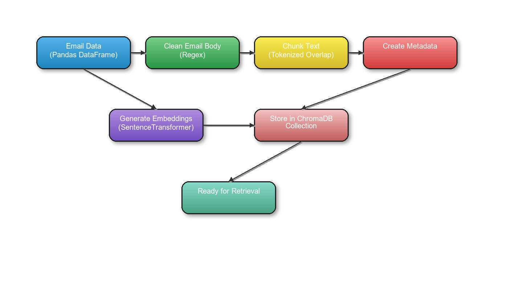

# HelpMate_Email_Search_AI
HelpMate Email Search AI Chatbot

# Email Search AI

## Problem Statement

In enterprise environments, email threads often contain critical discussions, decisions, and context across multiple stakeholders. However, locating specific information within large, unstructured, and nested email threads is time-consuming and inefficient using conventional keyword-based search tools. Professionals face challenges in extracting relevant insights without wading through entire conversations manually. There is a pressing need for an intelligent system that enables **semantic search** and **automated summarization** of email threads.

## Project Overview

**HelpMate_Email Search_AI** is an end-to-end **RAG-based AI assistant** designed for semantic search and summarization of email threads. It uses **Sentence Transformers** for creating dense **vector embeddings** of email content, stores them in a **ChromaDB vector store**, and enables **semantic index search**. Upon receiving a user query, it retrieves the most relevant chunks using **vector similarity**, improves result quality through **cross-encoder-based reranking**, and finally, generates context-aware responses using **OpenAI's LLM (e.g., GPT-3.5-turbo)**.

The system employs a **Retrieval-Augmented Generation (RAG)** architecture with **caching** for efficiency and performance.

## Project Objectives

- **Semantic Understanding of Emails**: Use **Sentence Transformers (all-MiniLM-L6-v2)** to convert email chunks into vector representations capturing semantic meaning.

- **Vector Database Indexing**: Store email embeddings in **ChromaDB**, enabling fast approximate nearest neighbor (ANN) vector search.

- **Semantic Search & Retrieval**: Support user queries via **embedding-based similarity search** across indexed email chunks.

- **Result Reranking**: Improve retrieval accuracy with **cross-encoder reranking (ms-marco-MiniLM-L-6-v2)**, scoring relevance between query and result pairs.

- **Contextual Answer Generation**: Use a **Retrieval-Augmented Generation (RAG)** pipeline to feed retrieved results into OpenAI GPT models for answer synthesis.

- **Query Caching**: Implement a file-based **caching** layer to store query results and avoid repeated computations.

## Functional Features

| **Component**                   | **Description**                                                                 | **Technology Used**                             |
|--------------------------------|---------------------------------------------------------------------------------|-------------------------------------------------|
| **Email Preprocessing**        | Cleans raw email bodies by removing quoted replies and normalizing text         | `Regex`, custom cleaning                        |
| **Chunking**                   | Splits cleaned emails into overlapping token-limited chunks                     | Custom logic                                    |
| **Embeddings**                 | Transforms email chunks into dense semantic vectors                             | `SentenceTransformer` (`all-MiniLM-L6-v2`)      |
| **Vector Indexing**            | Stores and indexes embeddings for fast similarity search                        | `ChromaDB`                                      |
| **Query Embedding**            | Embeds natural language queries for semantic comparison                         | `SentenceTransformer`                           |
| **Initial Vector Search**      | Retrieves top-N similar email chunks using ANN search                           | `ChromaDB`                                      |
| **Reranking**                  | Reorders retrieved results by true semantic relevance                           | `CrossEncoder` (`ms-marco-MiniLM-L-6-v2`)       |
| **Retrieval-Augmented Generation (RAG)** | Combines retrieved chunks with the query to form a prompt for GPT      | `OpenAI GPT-3.5-turbo`                          |
| **Answer Generation**          | Synthesizes a coherent answer based on context                                  | `OpenAI Chat Completion API`                    |
| **Caching**                    | Stores query results using hashed query keys for faster repeat access           | JSON file-based custom `Cache` class            |

**Columns**:
- **thread_id**: A unique identifier for each email thread.
- **subject**: Subject of the email thread.
- **timestamp**: Timestamp indicating when the message was sent.
- **from**: Sender of the email.
- **to**: List of recipients of the email.
- **body**: Content of the email message.

## Overall strcture of the code
email-search-ai/
│
├── email_dataset/
│   └── email_thread_summary.csv 
│
├── src/
│   ├── embedding_layer.py
│   ├── search_layer.py
│   ├── cache.py
│   ├── generation_layer.py
│   └── utils.py
│
├── outputs/
│   ├── search_screenshots/
│   ├── generation_screenshots/
│
├── docs/
│   └── project_documentation.md
│
├── main.py
└── requirements.txt

## Embedding Layer

## Cache Layer

## Search Layer

## Generation Layer

## Future Enhancements

**Embedding Layer Enhancements:**

- Parallelize or batch chunking and embedding for large datasets.

- Support multilingual email embedding using a multilingual transformer model (e.g., distiluse-base-multilingual-cased).

- Add logging and error handling during embedding and chunking.

- Deduplicate similar chunks before storing in the vector DB to reduce redundancy.

- Store additional metadata (e.g., department, priority) to enable advanced filtering during search.

**Cahce Layer Enhancements:**

- Replace JSON with Redis or SQLite for faster lookup and persistence in multi-user environments.

- Add cache eviction policy (e.g., LRU) to avoid unlimited growth.

- Track cache hit/miss stats for performance analytics.

- Encrypt cache contents if storing sensitive queries or responses.

**Search Layer Enhancements:**

- Improve reranking with better cross-encoders like bge-reranker or cohere models.

- Add semantic filters beyond thread_id (e.g., date, sender, topic).

- Support multi-query or follow-up query handling (e.g., thread-based QA).

- Paginate results and allow sorting based on relevance, timestamp, etc.

- Expose the search as an API with configurable parameters.

**Generation Layer Enhancements:**

- Use function calling / structured output instead of plain text (for automation).

- Support custom prompt templates per use case (summarization, classification, etc.).

- Switch to a self-hosted model (e.g., LLaMA 3, Mistral) for cost and privacy control.

- Limit token count dynamically to avoid truncation of large prompts.

- Stream responses if using GPT-4-turbo for better UX.

**Overall Architecture Enhancements**

- Centralized logging and monitoring (e.g., using logging, Sentry, or Prometheus).

- Unit and integration tests for all layers to ensure robustness.

- Add retry mechanisms for external API calls (OpenAI, Chroma).

- Implement role-based access control (RBAC) if deployed in an enterprise environment.

- Deploy as a containerized microservice (Docker + FastAPI) with endpoints for embedding, search, and generation.

- Add a front-end interface for uploading emails, searching threads, and viewing generated insights.